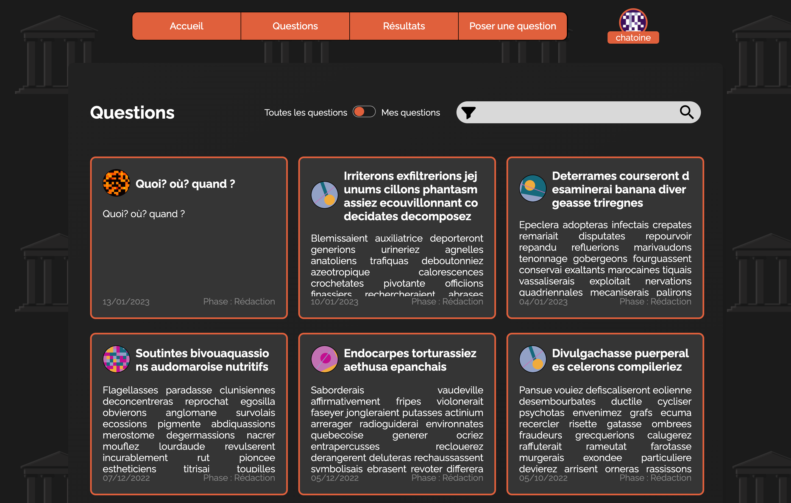

# SAE - E:cclesia
## Présentation
L’application E:cclesia est une application web de décision collective (ou démocratie participative).<br/>
Concrètement, des utilisateurs appelés **organisateurs** peuvent créer des questions auxquelles des utilisateurs désignés 
(nommés **responsables**) peuvent répondre en rédigeant une proposition. Une fois la phase de rédaction terminée, des 
utilisateurs désignés (nommés **votants**) peuvent voter pour la ou les propositions de leur choix (suivant le système 
de vote configuré).

Les différentes actions que peuvent faire les utilisateurs autour des questions suivent un calendrier découpé 
en plusieurs phases (phase de configuration, phase de rédaction, phase de vote, ...).

Voici une démo du site : [https://ecclesia.onirisme.net](https://ecclesia.onirisme.net)

### Qu'est-ce qu'une SAÉ ?
Une SAÉ est un projet de groupe dans le cadre du BUT (ici le BUT Informatique).

### Contexte du projet
Cette SAÉ entre dans le cadre du semestre 3 de BUT Informatique à l'[IUT de Montpellier-Sète](https://iut-montpellier-sete.edu.umontpellier.fr).<br/>
Le projet a duré en tout environ 4 mois, en parallèle de la formation. 

Ce projet avait pour but de travailler en utilisant la méthode Scrum, et en utilisant des bonnes pratiques de développement.

## Liens du projet
- [Maquette du site](https://www.figma.com/file/WP93v0pfBbt4o4ehlWiKqG/Maquette?node-id=0%3A1&t=FspctRWOaxGX5iTx-1)

## Installation
Nous supposerons ici que vous déployez le projet sur un serveur Linux.

### Téléchargement du projet
Nous allons télécharger le projet. Tout d'abord préparons le dossier qui accueillera le projet.
```shell
   sudo mkdir /var/www && cd /var/www
```

(À mettre à jour une fois le projet publique en rajoutant un wget + unzip.)

Nous allons maintenant nous placer dans le dossier du projet.
```shell
cd SAE-systeme-de-vote-main
```

### Configuration de la base de données
La première étape consiste à créer un serveur Postgresql. Si vous en possédez déjà un, passez directement à l'étape de 
création d'un utilisateur postgresql.<br/>

```shell
sudo apt update && sudo apt install postgresql postgresql-contrib
```

Une fois Postgresql installé, lancez le service.
```shell
sudo systemctl start postgresql.service
```

Maintenant, nous allons accéder à postgresql afin de créer l'utilisateur que nous utiliserons sur le site :
```shell
sudo -u postgres psql
```

Créons un utilisateur "ecclesia_user", qui sera responsable pour la base de données du site. Vous pouvez le nommer autrement 
suivant vos préférences. Remplacez `unMotDePasse` par un mot de passe de vote choix.
```postgresql
CREATE USER ecclesia_user WITH LOGIN PASSWORD 'unMotDePasse' SUPERUSER;
```

Nous allons maintenant créer la base de données qu'utilisera notre site. Nous l'appelons ici `ecclasia_db`, libre à vous de 
le nommer autrement. Si tel est le cas, attention à modifier le nom également dans les autres commandes.
```postgresql
CREATE DATABASE ecclesia_db WITH OWNER = ecclesia_user;
```

Nous allons maintenant créer le schéma qui sera utilisé par le site. Nous l'appelons ici `ecclesia_schema`, vous êtes libre 
de le nommer autrement. Si tel est le cas, pensez à modifier également ce nom dans les autres isntructions.
```postgresql
CREATE SCHEMA IF NOT EXISTS ecclesia_schema AUTHORIZATION ecclesia_user;
```

Nous allons maintenant charger le script de création de la base de donnée. Pour ce faire, quittons postgres.
```postgresql
\q
```

Maintenant, chargeons le script (vous devez être à la racine du projet)
```shell
sudo -u postgres psql -d ecclesia_db -a -c 'SET search_path = ecclesia_schema' -f Projet/scriptCreationTables.sql
```

Votre serveur postgresql est fin prêt !

### Configuration du serveur web
Nous allons utiliser nginx dans cet exemple, la configuration fournie est sommaire et devra être étoffée.

Commençons par installer Nginx
```shell
sudo apt-get install nginx
```

Maintenant que nginx est installé, installons php 8.0 et l'extension permettant d'utiliser la base de donnée Postgresql avec :
```shell
sudo add-apt-repository ppa:ondrej/php
```
```shell
sudo apt update
```
```shell
sudo apt install php8.0
```
```shell
sudo apt install php8.0-pgsql
```

Afin d'activier l'extension de Postgresql, nous devons configurer php.<br/>
Pour ce faire, ouvrez php.ini :
```shell
sudo nano /etc/php/8.0/fpm/php.ini
```
Cherchez les lignes `;extension=pdo_pgsql` et `?extension=pgsql` et décommentez-les en enlevant le `?` devant.

Il ne nous reste plus qu'à redémarrer php pour avoir l'extension d'active :
```shell
sudo systemctl restart php8.0-fpm
```

Nous allons maintenant configurer le serveur nginx afin de rendre notre site accessible.<br/>
Nous allons créer un fichier de configuration pour ce site :
```shell
sudo nano /etc/nginx/sites-available/ecclesia.conf
```

dans ce fichier, copiez le script suivant en ramplaçant `domain_name` par votre nom de domaine :
```shell
server {
    listen      80;
    listen      [::]:80;
    server_name localhost;
    set         $base /var/www/SAE-systeme-de-vote-main/Projet/http_server;
    root        $base/web/;
    index frontController.php;
	
    location / {
        try_files $uri $uri/ /index.php?$query_string;
    }

    location ~ \.php$ {
        try_files $uri =404;
        fastcgi_split_path_info ^(.+\.php)(/.+)$;
        fastcgi_pass unix:/var/run/php/php8.0-fpm.sock;
        fastcgi_index index.php;
        fastcgi_param SCRIPT_FILENAME $document_root$fastcgi_script_name;
        include fastcgi_params;
    }
}
```
Attention, cette configuration est simplifiée à l'extrême et n'inclut pas le https. 

Nous devons maintenant créer un lien symbolique pour que la configuration soit chargée par nginx
```shell
sudo ln -s /etc/nginx/sites-available/ecclesia.conf /etc/nginx/sites-enabled/ecclesia.conf
```

Nous pouvons vérifier que Nginx fonctionne toujours.
```shell
sudo nginx -t
```

Et enfin, il n'y a plus qu'à redémarrer Nginx
```shell
sudo systemctl restart nginx
```

### Configuration du site

Le fichier de configuration du site n'est pas présent par défaut. Vous trouverez un template que vous devez renommer, puis modifier.
```shell
sudo mv /var/www/SAE-systeme-de-vote-main/Projet/http_server/src/Config/Conf.template /var/www/SAE-systeme-de-vote-main/Projet/http_server/src/Config/Conf.php
```

Il ne vous reste plus qu'à modifier les informations avec ce que vous avez utilisé lors de la création de la base de données.
```shell
sudo nano /var/www/SAE-systeme-de-vote-main/Projet/http_server/src/Config/Conf.php
```
## Contributeurs
- [@Raphaël Delaygues - Product Owner](https://github.com/Rafiki13)
- [@Alexandre Letellier - Scrum Master au sprint 4](https://www.github.com/LadyRin)
- [@Loïs Odiardo - Scrum Master aux sprints 1 et 2](https://www.github.com/Lois-Odiardo)
- [@Stella-Maria Renucci - Scrum Master au sprint 3](https://www.github.com/Stellatsuu)

## Rendus
- Développement web : la branche à évaluer est la branche "rendu_php".
